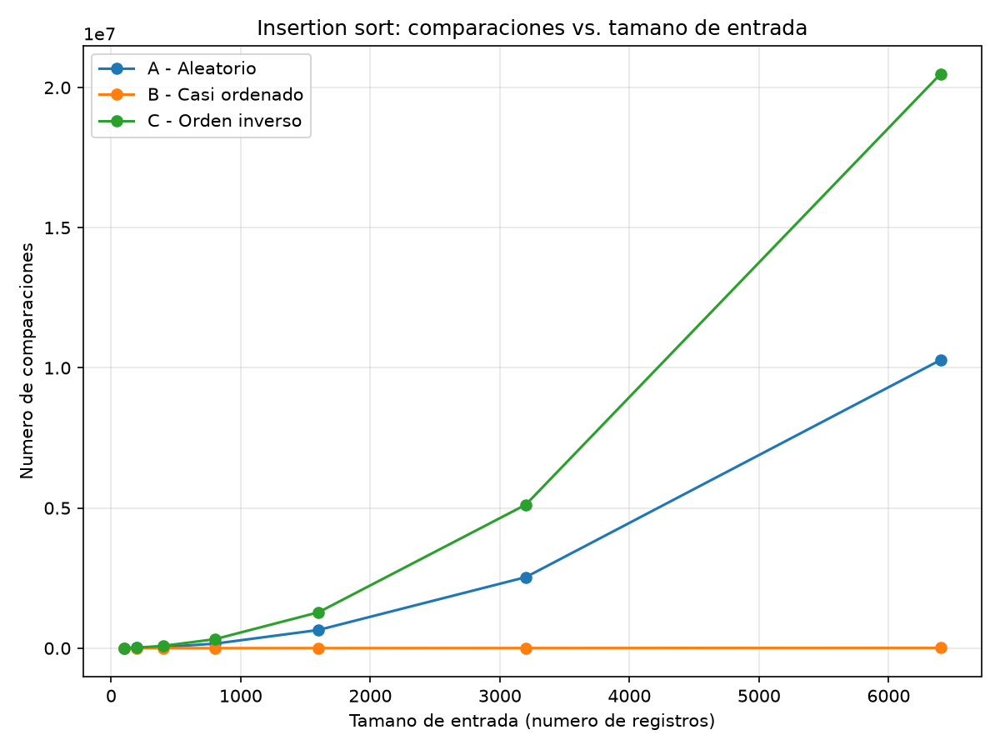
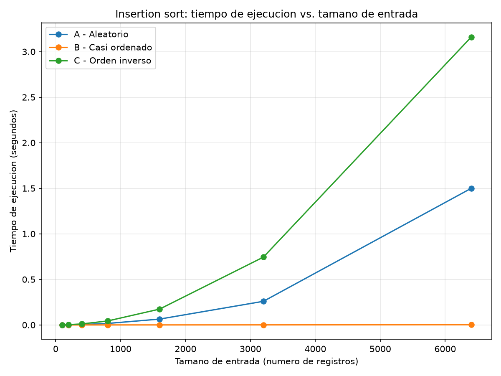
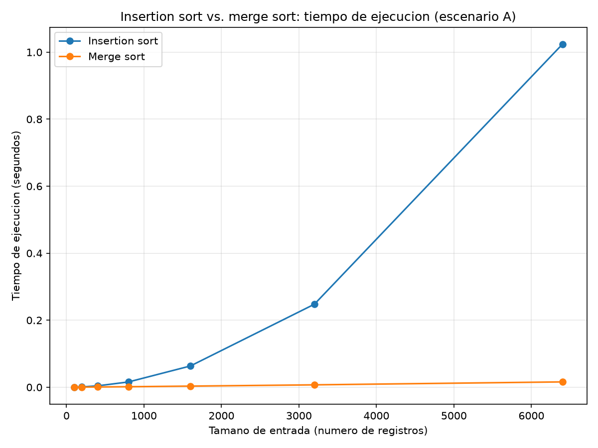

# Laboratorio 1 — Fundamentos, complejidad y recurrencias

**Nombre completo:** David Viloria
**Correo:** david_viloria04@hotmail.com
**Semestre:** 2026-2
**Caso analizado:** Plataforma Tamiza — Secretaría de Salud departamental

**Convención de orden usada en todo el laboratorio:** todos los generadores y los
dos algoritmos ordenan de **mayor a menor** índice de riesgo, porque es el orden
que Tamiza necesita para llamar primero a los pacientes de mayor riesgo. Esta
convención es consistente en `algoritmos.py`, `datos.py`, `parte3_casos.py` y
`parte4_complejidad.py`.

## Instrucciones de reproducción

El entorno virtual vive en la raíz del repositorio (`curso-analisis-algoritmos/`),
un nivel arriba de esta carpeta.

```bash
# 1. Ubicarse en la raíz del repositorio
cd curso-analisis-algoritmos

# 2. Crear el entorno virtual (si no existe) y activarlo
python -m venv .venv
# Windows (PowerShell):
.venv\Scripts\Activate.ps1
# Linux / Mac:
source .venv/bin/activate

# 3. Instalar dependencias
pip install -r requirements.txt

# 4. Ubicarse en la carpeta de este laboratorio
cd lab1-fundamentos-complejidad-recurrencias

# 5. Ejecutar cada parte
python parte3_casos.py          # genera graficas/parte3_comparaciones.png y graficas/parte3_tiempo.png
python parte4_complejidad.py    # genera graficas/parte4_tiempo.png
```

Cada script imprime en consola el tiempo y las comparaciones medidas para cada
tamaño de entrada, además de guardar las gráficas correspondientes en `graficas/`.

---

## Parte 1 — Analizar el algoritmo antes de comprar hardware

Para entender por qué la compra de un servidor más rápido no es la solución,
primero hay que separar dos conceptos: que un algoritmo sea **correcto** no
significa que sea **eficiente**. En el caso de Tamiza, el código actual con
insertion sort es correcto porque efectivamente ordena a los pacientes de
mayor a menor riesgo. Sin embargo, no es eficiente **en tiempo frente a la
ventana de cuatro horas** (de 2:00 a. m. a 6:00 a. m.): incumple esa
restricción concreta del sistema. De nada sirve tener la lista perfecta si no
está lista cuando los operadores empiezan a llamar.

El área de infraestructura propone duplicar la velocidad del procesador, pero
esto ignora la matemática detrás del algoritmo. Insertion sort tiene un
crecimiento cuadrático, Θ(n²). Cuando el programa pasó de 20.000 a 1.200.000
registros, la cantidad de datos se multiplicó por 60, pero el tiempo de
ejecución se multiplica aproximadamente por 60² = 3.600. Si compramos un
servidor del doble de velocidad, solo dividimos ese tiempo entre 2 (queda en
unas 1.800 veces el tiempo original), lo cual sigue desbordando por completo
la ventana de cuatro horas. Es tratar de vaciar el océano con una cubeta que
es el doble de grande.

Un ejemplo personal donde vi esto fue en el sistema de matrícula de materias
de la universidad. El algoritmo que verifica si un estudiante cumple los
prerrequisitos funcionaba perfecto en las pruebas (era correcto), pero cuando
abrieron el sistema y unos 10.000 estudiantes intentaron matricularse en la
misma ventana de un minuto, el sistema colapsó: para validar cada
prerrequisito, buscaba linealmente en toda la base de datos de materias
aprobadas de todos los estudiantes (más de un millón de registros
acumulados), en vez de consultar solo los registros del estudiante en
cuestión. Cada búsqueda individual no era lenta en sí misma (unas decenas de
milisegundos), pero como el servidor solo podía atenderlas en fila, el tiempo
acumulado en cola creció hasta varios minutos: cualquier estudiante detrás de
los primeros 500-800 en la fila ya superaba los 30-60 segundos que el
navegador tolera antes de dar la solicitud por caída. Esa latencia acumulada
bajo carga concurrente era la restricción incumplida, no la lentitud de una
sola búsqueda. Por más RAM que le pusieran al servidor, la única forma de que
el sistema fuera viable fue cambiar la validación de búsqueda lineal a un
índice (tabla hash), que elimina la cola desde la raíz.

---

## Parte 2 — Responsabilidad ambiental y ética de la implementación

Como futuro ingeniero y responsable técnico de Tamiza, soy consciente de que
las líneas de código que escribimos impactan directamente en el mundo real.

**Dimensión ambiental.** Tener un algoritmo ineficiente como insertion sort
procesando 1.200.000 registros implica tener a los procesadores del servidor
trabajando al 100% de su capacidad durante horas, disipando calor y
consumiendo una cantidad considerable de energía eléctrica. Cuando este
consumo innecesario se multiplica por cada madrugada, los 365 días del año,
durante los 8 años que lleva el sistema operando, la huella de carbono
generada es enorme. En nuestra propia medición ([parte4_complejidad.py](parte4_complejidad.py),
`graficas/parte4_tiempo.png`), insertion sort tardó 1,02 s frente a 0,016 s de
merge sort para ordenar 6.400 registros — con 1.200.000 registros esa
diferencia se dispara a horas de CPU, cada madrugada. Es un desperdicio
energético totalmente evitable si usáramos un algoritmo asintóticamente
mejor que resuelve el mismo problema en segundos.

**Dimensión ética y costos humanos.** Un fallo o lentitud extrema en este
proceso afecta vidas reales. Identifico dos perjuicios directos:

- *El paciente crítico.* Si el proceso no termina a las 6:00 a. m. y la lista
  queda incompleta, un paciente con un riesgo de 980 podría quedar por fuera
  del lote de llamadas del día. El costo de este error lo asume directamente
  el paciente, con su salud o su vida.
- *El operador del centro de contacto.* Al recibir una lista cortada o sin
  ordenar, los asesores empiezan a llamar a ciegas o tienen que priorizar
  manualmente. El costo aquí lo asumen los operadores, en forma de estrés
  laboral y decisiones que no les correspondía tomar, y la Secretaría de
  Salud, con una pérdida de confianza pública.

**La tensión del ordenamiento.** Este caso tiene una carga ética particular
porque ordenar la lista es, en la práctica, hacer un triaje médico: el
ordenamiento decide quién recibe atención primero y quién debe esperar. Esto
impone una obligación superior sobre la **corrección** del algoritmo, más
allá de su velocidad: no basta con que termine rápido, tiene que ordenar de
forma exacta y estable. Si el código falla y pone a un paciente de riesgo
bajo por encima de uno crítico, el software se convierte en un riesgo para
la salud pública.

---

## Parte 3 — Peor caso, mejor caso y caso promedio, demostrados en Python

Código de esta parte: [parte3_casos.py](parte3_casos.py), que usa
[algoritmos.py](algoritmos.py) (`insertion_sort`) y
[datos.py](datos.py) (los tres generadores de escenarios).

### 3.1 — Explicación

**Definiciones.** Para un algoritmo y un tamaño de entrada **n fijo**, se
considera el conjunto de *todas* las entradas posibles de tamaño n (todos los
arreglos/permutaciones de n elementos que el algoritmo podría recibir):

- **Peor caso:** el **máximo** del costo (tiempo, comparaciones) tomado sobre
  ese conjunto de entradas de tamaño n — la disposición de datos que más
  trabajo le exige al algoritmo.
- **Mejor caso:** el **mínimo** del costo tomado sobre ese mismo conjunto — la
  disposición que menos trabajo le exige.
- **Caso promedio:** el **promedio** (valor esperado) del costo sobre ese
  conjunto, asumiendo una distribución de probabilidad sobre las entradas
  (típicamente, todas las permutaciones igual de probables). No es "un caso
  intermedio a ojo": es una esperanza matemática sobre un conjunto de entradas
  y una distribución declarados explícitamente.

**¿Cuál caso usar para decidir si Tamiza entra en producción?** El **peor
caso**. La ventana de cuatro horas es una restricción dura, no negociable, y
Tamiza no controla ni puede predecir con certeza qué canal de origen (A, B o C)
llegará un día dado. Diseñar la decisión sobre el caso promedio dejaría el
sistema expuesto a fallar exactamente los días en que llega el escenario más
costoso — que es, de hecho, lo que ya ocurrió tres veces según el enunciado.

**Predicción (antes de medir):**

| Escenario | Predicción | Razonamiento |
|---|---|---|
| C — Orden inverso | **Peor caso** | El arreglo llega en orden ascendente, exactamente al revés del orden descendente objetivo. Cada nuevo elemento es menor que *todos* los ya colocados, así que debe desplazarlos a todos antes de encontrar su lugar: el número de comparaciones para el i-ésimo elemento es siempre i (el máximo posible), dando Θ(n²) en total. |
| B — Casi ordenado | **Mejor caso** | El 98% inicial ya está en el orden final exacto, así que cada uno de esos elementos solo necesita 1 comparación contra su predecesor inmediato. El costo debería quedar mucho más cerca de Θ(n) que de Θ(n²). |
| A — Aleatorio | **Caso promedio** | Ninguna estructura previa favorece ni perjudica al algoritmo de forma sistemática; se espera un número de comparaciones proporcional a n²/4 (Θ(n²), pero con una constante bastante menor que el peor caso exacto). |

*(Esta predicción quedó confirmada por el experimento — ver 3.2. Si al correr
tu propio experimento un resultado no coincidiera con tu predicción, esa
discrepancia se explica aquí, no se oculta.)*

### 3.2 — Demostración experimental

**Metodología de medición:** para cada escenario y cada uno de los 7 tamaños de
entrada (100, 200, 400, 800, 1600, 3200, 6400), se generan los datos **sin
cronometrar la generación**, y se corre `insertion_sort` tres veces sobre la
misma entrada (que no se modifica entre corridas), tomando la **mediana** del
tiempo con `time.perf_counter()` para reducir el ruido del sistema operativo.
El número de comparaciones es determinista para una entrada dada, así que se
reporta una sola vez. Se observó en la práctica que el tiempo de una misma
medición puede variar más de 30% entre corridas separadas en esta máquina
(ver la comparación con la Parte 4 más abajo), lo que confirma que medir una
sola vez habría sido poco confiable.

**Comparaciones vs. tamaño de entrada:**



**Tiempo de ejecución vs. tamaño de entrada:**



**Datos medidos (n=6400, el tamaño más grande probado):**

| Escenario | Comparaciones | Tiempo (mediana de 3 corridas) |
|---|---:|---:|
| A — Aleatorio | 10.276.753 | 1,499466 s |
| B — Casi ordenado | 10.277 | 0,001974 s |
| C — Orden inverso | 20.476.800 | 3,159284 s |

**Análisis:**

- **C (orden inverso) fue el peor caso**, con evidencia exacta: en n=6400 hizo
  20.476.800 comparaciones, que coincide *exactamente* con la cota
  n(n-1)/2 = 6400·6399/2 = 20.476.800. La curva de comparaciones para C crece
  de forma claramente cuadrática (cóncava hacia arriba) en ambas gráficas.
- **B (casi ordenado) fue el mejor caso**, con 10.277 comparaciones en
  n=6400 — del mismo orden de magnitud que n, no que n². La razón concreta:
  el 98% inicial (los índices 129 a 6400, ya en orden descendente) solo
  aporta una comparación por elemento; el 2% final son valores más pequeños
  que todo el bloque anterior, así que cada uno de ellos, al insertarse,
  compara contra los pocos elementos del 2% ya colocados y luego contra el
  último elemento del bloque ordenado — que por ser mayor, detiene la
  inserción de inmediato. Por eso el costo no se dispara aunque exista una
  porción desordenada.
- **A (aleatorio) se aproximó al caso promedio teórico**, con 10.276.753
  comparaciones en n=6400 frente a la predicción teórica n²/4 = 10.240.000
  (una diferencia menor al 0,4%): el resultado cae, como se esperaba, entre
  el mejor y el peor caso, más cerca del peor caso en magnitud pero con una
  constante notablemente menor.
- **La predicción de 3.1 se cumplió sin contradicción**: C peor, B mejor, A
  promedio, en los tres tamaños y en las dos métricas (tiempo y
  comparaciones).

---

## Parte 4 — Complejidad de merge sort e insertion sort: cálculo y validación

Código de esta parte: [parte4_complejidad.py](parte4_complejidad.py), que
agrega `merge_sort` a [algoritmos.py](algoritmos.py).

### 4.1 — Cálculo teórico

#### Recurrencia de merge sort

Merge sort divide el arreglo de tamaño n en dos mitades, ordena cada mitad
recursivamente, y combina (mezcla) las dos mitades ya ordenadas. De ahí sale
cada término de:

**T(n) = 2·T(n/2) + Θ(n)**

- **2**: el algoritmo genera exactamente **2 subproblemas** por llamada (una
  mitad izquierda y una mitad derecha).
- **T(n/2)**: cada subproblema tiene **la mitad del tamaño** del problema
  original, y se resuelve con el mismo algoritmo (recursión).
- **Θ(n)**: es el costo de **combinar** — la función `_combinar` en
  [algoritmos.py](algoritmos.py) recorre linealmente los n elementos totales
  de las dos mitades (ya ordenadas) para intercalarlos en un único arreglo
  ordenado. Recorrer n elementos una vez es Θ(n).
- Caso base: T(1) = Θ(1) (un solo elemento ya está ordenado).

#### Resolución por árbol de recursión

```
Nivel 0:                              [ T(n) ]                         costo del nivel: c·n
                                      /         \
Nivel 1:                     [T(n/2)]           [T(n/2)]               costo del nivel: 2 · c·(n/2)  = c·n
                             /       \           /       \
Nivel 2:               [T(n/4)] [T(n/4)]   [T(n/4)] [T(n/4)]           costo del nivel: 4 · c·(n/4)  = c·n
                                    ...                  ...
Nivel i:        2^i subproblemas, cada uno de tamaño n/2^i              costo del nivel: 2^i · c·(n/2^i) = c·n
                                    ...
Nivel log2(n):  n subproblemas de tamaño 1 (casos base, Θ(1) cada uno)  costo del nivel: n · Θ(1) = Θ(n)
```

- **Costo por nivel:** en cualquier nivel i (antes de llegar a las hojas), hay
  2^i subproblemas, cada uno de tamaño n/2^i y costo de combinar c·(n/2^i).
  El costo del nivel es 2^i · c·(n/2^i) = c·n: **constante en todos los
  niveles**.
- **Número de niveles:** el tamaño del subproblema en el nivel i es n/2^i;
  se llega a tamaño 1 cuando n/2^i = 1, es decir, i = log2(n). Contando desde
  el nivel 0 hasta el nivel log2(n), hay **log2(n) + 1 niveles**.
- **Costo total:** se suma el costo (c·n) por cada uno de los (log2(n) + 1)
  niveles:

  T(n) = (log2(n) + 1) · c·n = c·n·log2(n) + c·n = **Θ(n log n)**

#### Cota de insertion sort, línea a línea

Numerando las líneas ejecutables de `insertion_sort` en
[algoritmos.py](algoritmos.py):

```
1   resultado = list(datos)                      # c1  · 1
2   comparaciones = 0                            # c2  · 1
3   for i in range(1, len(resultado)):           # c3  · n
4       clave = resultado[i]                     # c4  · (n-1)
5       j = i - 1                                # c5  · (n-1)
6       while j >= 0:                            # c6  · Σ tᵢ  (+ O(n) de chequeos que fallan)
7           comparaciones += 1                   # c7  · Σ tᵢ
8           if resultado[j] >= clave:            # c8  · Σ tᵢ
9               break                            # c9  · O(n)  (una vez por i, si no se agota el arreglo)
10          resultado[j + 1] = resultado[j]      # c10 · Σ tᵢ  (± O(n), ver nota)
11          j -= 1                               # c11 · Σ tᵢ  (± O(n), ver nota)
12      resultado[j + 1] = clave                 # c12 · (n-1)
13  return resultado, comparaciones              # c13 · 1
```

Nota de indentación: las líneas 10-11 están al mismo nivel que el `if` de la
línea 8 (no anidadas dentro de él): se ejecutan cuando la condición de la
línea 8 fue **falsa** (no hubo `break`), es decir, cuando todavía hay que
desplazar el elemento en `resultado[j]` y seguir buscando más a la izquierda.

donde **tᵢ** (1 ≤ tᵢ ≤ i) es el número de comparaciones que se hacen al
insertar el i-ésimo elemento: las líneas 7 y 8 se ejecutan exactamente Σtᵢ
veces por definición; las líneas 10-11 (el desplazamiento) se ejecutan Σtᵢ o
Σtᵢ − (n−1) veces según si cada inserción termina por `break` o por agotar el
arreglo — una diferencia de a lo sumo 1 por cada i, que no cambia el orden de
magnitud. Sumando todo:

**T(n) = c₁+c₂+c₁₃ + (c₄+c₅+c₁₂)(n−1) + (c₆+c₇+c₈+c₁₀+c₁₁)·Σᵢ₌₁ⁿ⁻¹ tᵢ = Θ(n) + Θ(Σ tᵢ)**

El término Θ(n) es fijo; todo el comportamiento asintótico depende de **Σtᵢ**:

- **Mejor caso:** tᵢ = 1 para todo i (el arreglo ya viene en el orden final) →
  Σtᵢ = n−1 → **T(n) = Θ(n)**. Coincide exactamente con lo medido en el
  escenario B casi ordenado.
- **Peor caso:** tᵢ = i para todo i (el arreglo viene exactamente al revés) →
  Σtᵢ = Σᵢ₌₁ⁿ⁻¹ i = n(n−1)/2 → **T(n) = Θ(n²)**. Coincide exactamente con lo
  medido en el escenario C.
- **Caso promedio:** en una permutación aleatoria, el valor esperado de tᵢ es
  aproximadamente (i+1)/2, así que Σ E[tᵢ] ≈ n²/4 → **T(n) = Θ(n²)**, con una
  constante menor que en el peor caso. Coincide con lo medido en el escenario A.

#### Tabla de complejidades

| Algoritmo | Mejor caso | Peor caso | Caso promedio |
|---|:---:|:---:|:---:|
| Insertion sort | Θ(n) | Θ(n²) | Θ(n²) |
| Merge sort | Θ(n log n) | Θ(n log n) | Θ(n log n) |

La fila de merge sort es la misma en las tres columnas: a diferencia de
insertion sort, su recurrencia **no depende de cómo vienen ordenados los
datos** — siempre divide por la mitad y siempre combina en Θ(n), sin importar
el contenido del arreglo.

### 4.2 — Validación experimental

**Tiempo de ejecución, insertion sort vs. merge sort, escenario A (aleatorio):**



**Datos medidos:**

| n | Insertion sort (s) | Merge sort (s) |
|---:|---:|---:|
| 100 | 0,000306 | 0,000131 |
| 200 | 0,000928 | 0,000286 |
| 400 | 0,004047 | 0,000683 |
| 800 | 0,015693 | 0,001509 |
| 1600 | 0,063431 | 0,003295 |
| 3200 | 0,247769 | 0,007088 |
| 6400 | 1,023524 | 0,015881 |

**Conclusión, leída en la gráfica:** la curva de insertion sort se dobla hacia
arriba cada vez con más fuerza (crecimiento convexo, acelerado): al pasar de
n=3200 a n=6400 (el doble de datos), el tiempo se multiplicó por
1,023524/0,247769 ≈ **4,13x**, muy cerca del 4x que predice un crecimiento
Θ(n²) al duplicar n. La curva de merge sort, en los mismos ejes, es casi plana
en comparación: en el mismo rango el tiempo se multiplicó solo por
0,015881/0,007088 ≈ **2,24x**, cercano al factor ≈2,17x que predice un
crecimiento Θ(n log n) al duplicar n (2 · log₂(6400)/log₂(3200)). Para Tamiza,
**merge sort es la mejor opción**: su curva crece mucho más lento que la de
insertion sort a medida que el volumen de registros aumenta, que es
exactamente la situación que está desbordando la ventana de 4 horas.

**Contraste con la teoría de 4.1:** el resultado coincide con lo calculado:
Θ(n²) para insertion sort y Θ(n log n) para merge sort, y la brecha entre las
dos curvas se agranda cada vez más rápido a medida que n crece — tal como
predice que una función cuadrática termine dominando a una n log n. Un detalle
que **no** coincide con la intuición ingenua ("merge sort es más lento en
entradas pequeñas por el costo de la recursión"): en estas mediciones, merge
sort ya fue más rápido que insertion sort *incluso en n=100* (0,000131 s
contra 0,000306 s). La explicación más probable es que, en Python, el costo
por comparación dentro del ciclo `while` de insertion sort (intérprete puro,
sin operaciones vectorizadas) ya es lo bastante alto para que el crecimiento
Θ(n²) supere a Θ(n log n) desde tamaños pequeños, incluso con el costo
adicional de crear sublistas y llamadas recursivas que tiene merge sort.

### 4.3 — Concepto técnico a la Secretaría de Salud

**Recomendación técnica.** Tras analizar el comportamiento del sistema ante
los tres escenarios de origen de datos (canal web, reproceso e historia
clínica), se recomienda formalmente reemplazar insertion sort por merge sort.
Dado que los canales de entrada pueden variar sin previo aviso, mantener
algoritmos distintos según el canal es insostenible para el equipo de
desarrollo. Merge sort garantiza una complejidad de Θ(n log n) en el 100% de
los casos (peor, mejor y promedio), mientras que insertion sort varía entre
Θ(n) y Θ(n²) según qué tan ordenados vengan los datos ese día. Esto significa
que el proceso siempre será predecible y seguro, sin importar si los datos
llegan desordenados, casi ordenados o al revés.

**Evaluación de la ventana de cuatro horas y propuesta de hardware.** La
propuesta de infraestructura de comprar un servidor del doble de velocidad
para mantener el código actual debe descartarse. En nuestro experimento con
el escenario A (datos aleatorios, `graficas/parte4_tiempo.png`), con un
tamaño de entrada de 6.400 registros insertion sort tardó 1,023524 s frente a
0,015881 s de merge sort — una diferencia de 64 veces — y la curva de
insertion sort ya muestra ahí un crecimiento claramente cuadrático.

Extrapolando esa medición (esto es una estimación, no una medición directa en
producción): 1.200.000 registros son 187,5 veces el tamaño que medimos. Como
insertion sort crece con el cuadrado del tamaño, el tiempo esperado se
multiplica por 187,5² ≈ 35.156, es decir, 1,023524 s × 35.156 ≈ 35.983 s ≈
**10 horas** — más del doble de la ventana disponible. Un servidor del doble
de velocidad solo divide ese tiempo entre 2, dejándolo en ~5 horas: **sigue
sin caber** en la ventana de cuatro horas.

Por el contrario, merge sort crece con n log n: el tiempo se multiplica por
187,5 × (log₂(1.200.000)/log₂(6.400)) ≈ 187,5 × 1,6 ≈ 299,5. Partiendo de los
0,015881 s medidos, el lote completo de 1.200.000 registros se procesaría en
aproximadamente 0,015881 s × 299,5 ≈ **4,8 segundos**. El algoritmo
recomendado cabe con enorme margen en la ventana nocturna, sin invertir un
solo peso en hardware nuevo.

**Consideraciones adicionales: memoria vs. tiempo.** Es importante que el
equipo tenga en cuenta un compromiso técnico: para lograr esta velocidad,
merge sort requiere memoria adicional del orden de Θ(n) para realizar las
mezclas, mientras que insertion sort ordena en el mismo arreglo, con memoria
adicional casi nula. Para 1.200.000 enteros esto se traduce en unas pocas
decenas de megabytes extra de RAM, un costo insignificante frente a un
servidor moderno. Sacrificar ese espacio en memoria a cambio de garantizar
que las llamadas críticas de salud se hagan a tiempo es la decisión técnica
correcta.

---

## Estructura del repositorio de este laboratorio

```
lab1-fundamentos-complejidad-recurrencias/
├── README.md
├── algoritmos.py
├── datos.py
├── parte3_casos.py
├── parte4_complejidad.py
└── graficas/
    ├── parte3_comparaciones.png
    ├── parte3_tiempo.png
    └── parte4_tiempo.png
```
