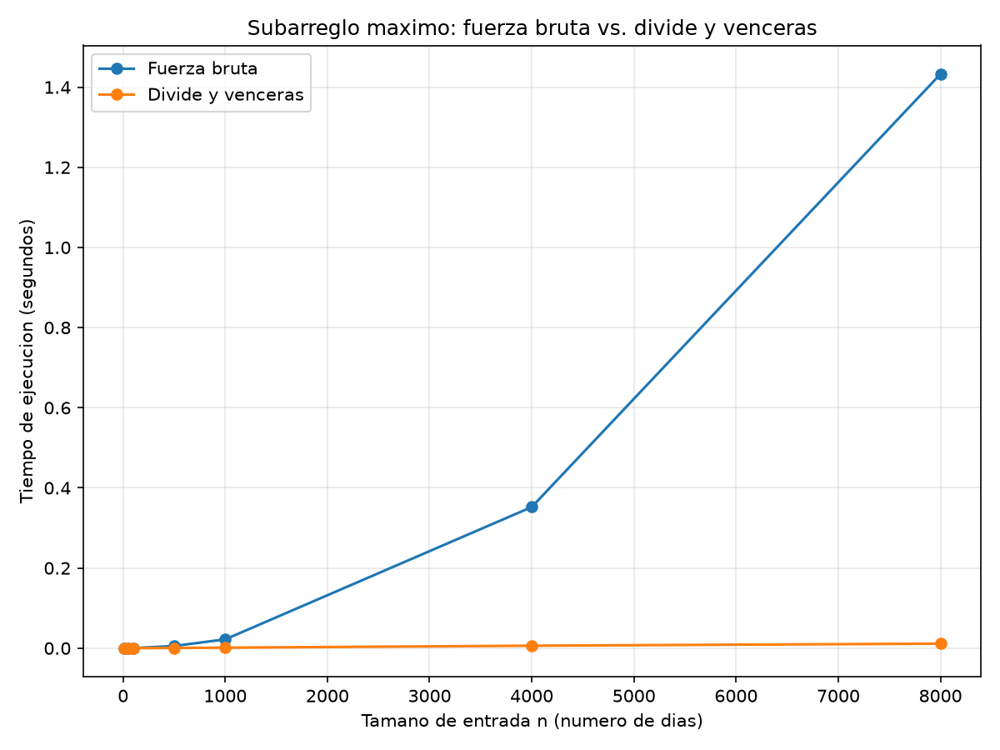

# Laboratorio 2 — Dividir y vencer

**Nombre completo:** David Viloria
**Correo:** david_viloria04@hotmail.com
**Semestre:** 2026-2
**Caso analizado:** Cooperativa de 1.500 tiendas de barrio — mejor racha de variación diaria de caja.

## Instrucciones de reproducción

El entorno virtual vive en la raíz del repositorio (`curso-analisis-algoritmos/`),
un nivel arriba de esta carpeta.

```bash
# 1. Ubicarse en la raíz del repositorio
cd curso-analisis-algoritmos

# 2. Crear el entorno virtual (si no existe) y activarlo
python -m venv .venv
# Windows (PowerShell):
.venv\Scripts\Activate.ps1
# Linux / Mac:
source .venv/bin/activate

# 3. Instalar dependencias
pip install -r requirements.txt

# 4. Ubicarse en la carpeta de este laboratorio
cd lab2-divide-y-vencer

# 5. Correr las pruebas de correctitud
python pruebas.py

# 6. Correr el experimento de medición (genera graficas/tiempo_vs_n.png)
python medicion.py
```

---

## Parte 1 — Implementar y verificar las dos soluciones

Código de esta parte: [subarreglo.py](subarreglo.py) y [pruebas.py](pruebas.py).

`subarreglo_fuerza_bruta` prueba todos los pares de días (i, j) en Θ(n²),
acumulando la suma dentro del ciclo en vez de recalcularla. `suma_cruzada`
hace un barrido lineal desde el punto medio hacia cada lado para encontrar
el mejor tramo que cruza el centro. `subarreglo_maximo` divide el rango por
la mitad, resuelve las dos mitades de forma recursiva, llama a
`suma_cruzada` para el caso cruzado, y devuelve el mejor de los tres —sin
llamar en ningún momento a la fuerza bruta.

`pruebas.py` verifica con `assert`, comparando siempre la suma (nunca los
índices, porque puede haber varios tramos con la misma suma máxima):

- La serie de ocho días de la situación problema (suma 17).
- Una serie de un solo elemento, positivo y negativo.
- Una serie con todos los valores negativos (la mejor racha es el menos
  negativo, solo).
- Una serie con todos los valores positivos (la mejor racha es la suma
  total).
- Un caso construido para que el mejor tramo cruce exactamente el punto
  medio de la primera llamada recursiva (verificado también llamando a
  `suma_cruzada` por separado).
- Veinte listas aleatorias (semilla fija) de tamaño variable, en las que
  `subarreglo_fuerza_bruta` y `subarreglo_maximo` deben coincidir en la
  suma, y donde además se verifica que ninguna función modifica la lista
  recibida.

Las 24 verificaciones pasan (`python pruebas.py` imprime "Todas las pruebas
pasaron.").

---

## Parte 2 — Medir y graficar

Código de esta parte: [medicion.py](medicion.py).

Se midió el tiempo de `subarreglo_fuerza_bruta` y `subarreglo_maximo` sobre
la misma lista (generada con semilla fija, enteros entre -100 y 100) para
siete tamaños: 10, 50, 100, 500, 1000, 4000 y 8000. Para cada tamaño se
corrió cada algoritmo tres veces y se tomó la **mediana** del tiempo con
`time.perf_counter()`, cronometrando únicamente la llamada al algoritmo. El
experimento verifica además, en cada tamaño, que ambos algoritmos devuelven
la misma suma máxima (lo cual se cumplió en los siete tamaños).



**Datos medidos (mediana de 3 corridas):**

| n | Fuerza bruta (s) | Divide y vencerás (s) |
|---:|---:|---:|
| 10 | 0,000005 | 0,000008 |
| 50 | 0,000056 | 0,000044 |
| 100 | 0,000207 | 0,000091 |
| 500 | 0,005436 | 0,000558 |
| 1000 | 0,022001 | 0,001191 |
| 4000 | 0,352191 | 0,006105 |
| 8000 | 1,432456 | 0,011272 |

En escala lineal, la curva de divide y vencerás queda pegada al eje
horizontal frente a la de fuerza bruta; por eso se incluye la tabla con los
valores exactos, necesaria para leer los tamaños pequeños en la Parte 3.

---

## Parte 3 — Análisis

**1. Recurrencia.** `subarreglo_maximo` divide `[inicio, fin]` en dos
mitades y hace dos llamadas recursivas más una llamada a `suma_cruzada`:
T(n) = 2·T(n/2) + Θ(n). El 2 son los dos subproblemas (mitad izquierda y
derecha); T(n/2) porque cada uno tiene la mitad del tamaño; y Θ(n) es el
caso cruzado, porque `suma_cruzada` recorre una sola vez, linealmente, los
n elementos del rango (barrido a la izquierda desde `medio` y a la derecha
desde `medio + 1`), más una comparación O(1) para combinar las tres sumas.
Caso base: T(1) = Θ(1). Por el método maestro, con a=2, b=2 y f(n)=Θ(n):
n^(log_b a) = n¹ = Θ(n), igual a f(n), así que aplica el **caso 2**
(f(n) = Θ(n^(log_b a))) y T(n) = Θ(n log n). La fuerza bruta es Θ(n²)
porque, para cada uno de los n valores de i, el ciclo interno recorre las
n−i posiciones restantes: n + (n−1) + ... + 1 = n(n+1)/2 = Θ(n²).

**2. Lo medido contra lo esperado.** En la gráfica, fuerza bruta se dobla
hacia arriba cada vez con más fuerza; divide y vencerás se mantiene casi
plana. Tomando n=4000 y n=8000 (n se duplica): fuerza bruta pasó de
0,352191 s a 1,432456 s, factor ×4,07 — casi el ×4 que predice Θ(n²) al
duplicar n. Divide y vencerás pasó de 0,006105 s a 0,011272 s, factor
×1,85, algo por debajo del ×2,17 que predice Θ(n log n) para ese salto
(2·log₂(8000)/log₂(4000)); la diferencia la explica el ruido de medición y
el costo fijo de las llamadas recursivas, que no está en el término
asintótico. Ambos factores confirman la teoría.

**3. Tamaños pequeños.** Sí hay cruce, pero no donde lo esperaba: en n=10,
fuerza bruta (0,000005 s) fue más rápida que divide y vencerás (0,000008
s), porque a esa escala ambos tiempos son microsegundos dominados por
ruido y por el costo fijo de la recursión, que pesa más que el ahorro
asintótico. Desde n=50 (0,000056 s vs. 0,000044 s) divide y vencerás ya
gana, y la ventaja crece sin interrupción: ×2,3 en n=100, ×9,7 en n=500,
×18,5 en n=1000, ×58 en n=4000 y ×127 en n=8000. La ventaja aparece antes
de lo esperado, salvo en el caso degenerado de n=10.

**4. ¿Cuándo conviene dividir?** No conviene dividir para hallar el máximo
de un arreglo: un recorrido lineal ya es Θ(n) y es óptimo. Si se divide a
la mitad, se halla el máximo de cada mitad y se combina comparando los dos
máximos, O(1): T(n) = 2·T(n/2) + Θ(1). Con a=2, b=2, f(n)=Θ(1):
n^(log_b a) = n domina a f(n) (**caso 1**), T(n) = Θ(n). Dividir no cambia
el orden —sigue Θ(n)— pero añade el costo real de las llamadas
recursivas: en la práctica solo empeora. La diferencia con el subarreglo
máximo es que ahí la fuerza bruta es Θ(n²) y combinar cuesta Θ(n): dividir
sí baja el orden. Dividir paga cuando combinar es barato frente a lo que
se ahorra en los subproblemas; si la solución directa ya es lineal,
dividir solo agrega overhead.

**5. Concepto para la gerente.** Recomiendo divide y vencerás
(`subarreglo_maximo`), sobre todo porque el equipo de datos planea escalar
a series de cientos de miles de registros. A partir de n=8000 (0,011272 s
divide y vencerás, 1,432456 s fuerza bruta) estimo —no con una regla de
tres lineal, porque cada algoritmo crece distinto— el tiempo para
1.000.000 de registros (125 veces el tamaño medido): fuerza bruta escala
por 125² = 15.625 (Θ(n²)), dando ≈ 22.382 s (**~6,2 horas**); divide y
vencerás escala por 125·(log₂(1.000.000)/log₂(8000)) ≈ 192 (Θ(n log n)),
dando ≈ **2,2 segundos**. Es una estimación a partir de la tendencia
medida, no una medición directa a ese tamaño. Para 1.500 tiendas con
historiales de ~2.000 días, fuerza bruta ya es más lenta sin necesidad; a
la escala de sensores que el equipo planea analizar, sería inviable.

---

## Estructura del repositorio de este laboratorio

```
lab2-divide-y-vencer/
├── README.md
├── subarreglo.py
├── pruebas.py
├── medicion.py
└── graficas/
    └── tiempo_vs_n.png
```
